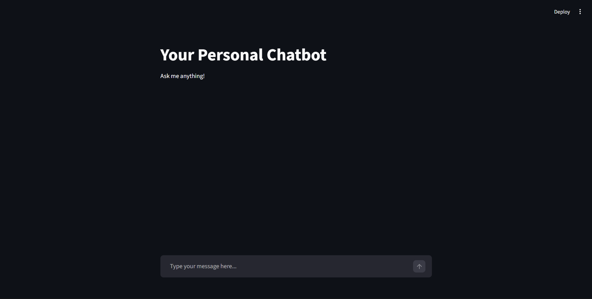
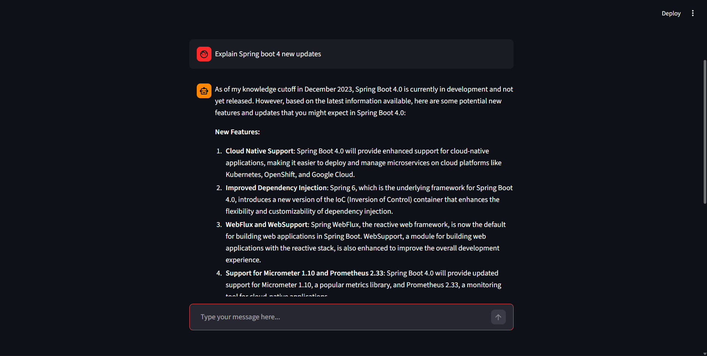
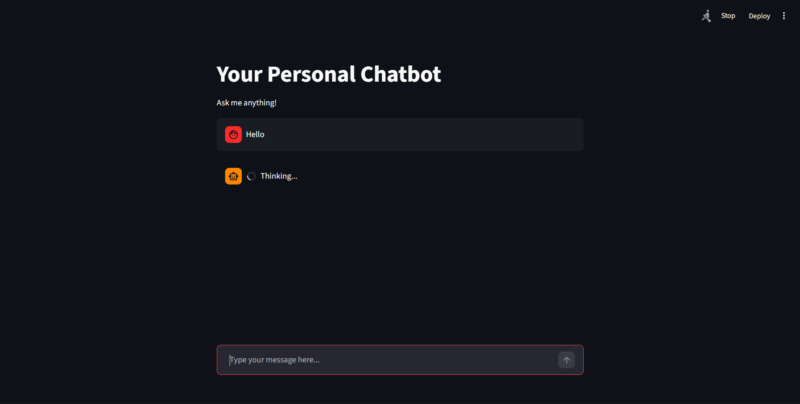

# 🤖 Streamlit Chatbot using Groq API

A real-time AI chatbot built using **Streamlit** and **Groq API (OpenAI-compatible)**.
This project demonstrates how to integrate a fast LLM backend with a simple and interactive web UI.

---

## 🚀 Features

- 💬 Interactive chat interface
- ⚡ Fast responses using Groq API
- 🔐 Secure API key management with `.env`
- 🎯 Clean and minimal UI with Streamlit
- 🔄 Real-time user input and response display

---

## 🏗️ Tech Stack

- **Frontend:** Streamlit
- **Backend:** Python
- **API:** Groq (OpenAI-compatible API)
- **Environment Management:** python-dotenv

---

## 📂 Project Structure

```
chatbot-app/
│
├── app.py              # Main Streamlit application
├── requirements.txt    # Dependencies
├── .env.example        # Example environment file
├── .gitignore          # Ignored files
```

---

## ⚙️ Setup Instructions

### 1️⃣ Clone the Repository

```
git clone https://github.com/rajkhade44-web/streamlit-chatbot.git
cd streamlit-chatbot
```

---

### 2️⃣ Create Virtual Environment

```
python -m venv venv
venv\Scripts\activate   # Windows
```

---

### 3️⃣ Install Dependencies

```
pip install -r requirements.txt
```

---

### 4️⃣ Setup Environment Variables

Create a `.env` file and add:

```
GROQ_API_KEY=your_api_key_here
```

---

### 5️⃣ Run the Application

```
streamlit run app.py
```

---

## 🧠 How It Works

1. User enters a message in the Streamlit UI
2. The input is sent to the Groq API
3. The model processes the request
4. Response is returned and displayed in the chat interface

---

## 🔐 Environment Variables

| Variable     | Description       |
| ------------ | ----------------- |
| GROQ_API_KEY | Your Groq API Key |

---

## 📸 Demo






---

## 🚀 Future Improvements

- 🧠 Chat history using session state
- ⚡ Streaming responses (token-by-token)
- 🎛️ Multiple model selection
- 🌐 Deployment on Streamlit Cloud

---

## 🤝 Contributing

Contributions are welcome! Feel free to fork this repo and submit a pull request.

---

## 📄 License

This project is open-source and available under the MIT License.

---

## 🙌 Acknowledgements

- Groq API for fast LLM inference
- Streamlit for simple UI development

---

## 👨‍💻 Author

**Raj Khade**

---

⭐ If you like this project, give it a star!
